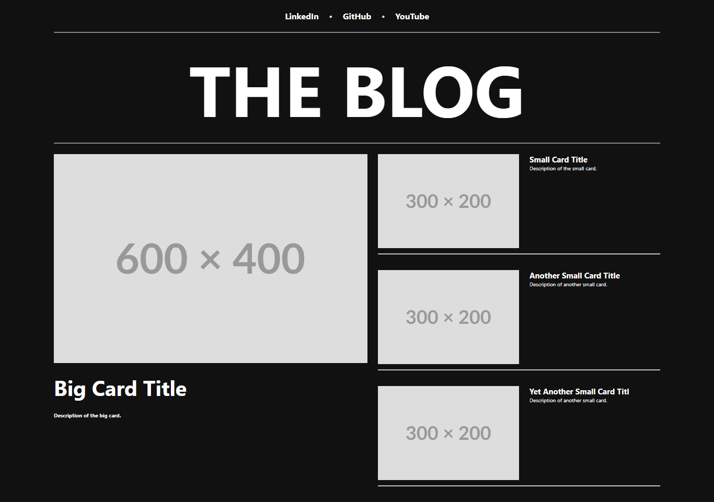
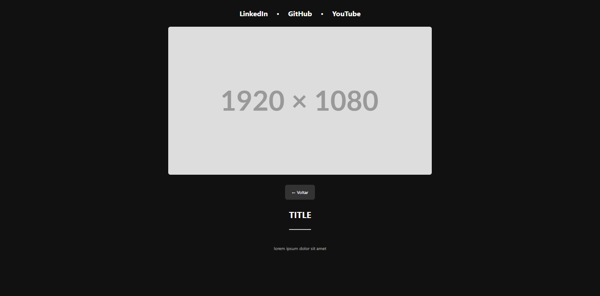

# Angular Blog

A responsive blog application built with Angular, featuring article listings and detailed content views.

### Home Page | Main Page



### Content Page | Article Detail Page



## Project Overview

This project is a simple blog application that demonstrates core Angular concepts including:

- Component-based architecture
- Responsive design
- Angular routing
- Data binding
- Parameter passing between components

## Features

- Responsive layout that adapts to different screen sizes
- Home page with featured articles in different layouts (big card and small cards)
- Article detail pages with dynamic content based on URL parameters
- Navigation between pages using Angular Router
- External links to social media/professional profiles

## Project Structure

```
angular-blog/
├── src/
│   ├── app/
│   │   ├── components/        # Reusable UI components
│   │   │   ├── big-card/      # Featured article component
│   │   │   ├── menu-bar/      # Navigation links component
│   │   │   ├── menu-title/    # Blog title component
│   │   │   └── small-card/    # Secondary article component
│   │   ├── data/              # Mock data for articles
│   │   ├── pages/             # Application pages
│   │   │   ├── content/       # Article detail page
│   │   │   └── home/          # Home/listing page
│   │   ├── app.component.*    # Root component
│   │   ├── app.routes.ts      # Application routes
│   │   └── app.config.ts      # Application configuration
│   └── styles.css             # Global styles
```

## Installation

1. Make sure you have [Node.js](https://nodejs.org/) (v18+) and npm installed
2. Clone this repository or download the source code
3. Install dependencies:

```bash
npm install
```

## Development

To start a development server:

```bash
npm start
```

Navigate to `http://localhost:4200/` to view the application. The app will automatically reload if you change any source files.

## Building for Production

To build the project for production:

```bash
npm run build
```

The build artifacts will be stored in the `dist/angular-blog` directory.

## Running with SSR (Server-Side Rendering)

This project includes Angular Universal for server-side rendering:

```bash
npm run build
npm run serve:ssr:angular-blog
```

Then navigate to `http://localhost:4000/` to see the SSR version.

## Customization

### Adding New Articles

To add or modify articles, edit the data array in `src/app/data/data.ts`:

```typescript
export const data = [
  {
    id: 1,
    title: "YOUR ARTICLE TITLE",
    description: "Your article description",
    photoCover: "URL to article image",
  },
  // Add more articles...
];
```

### Styling

The project uses CSS with media queries for responsive design. Global styles are in `src/styles.css`, and component-specific styles are in their respective folders.

## Technologies Used

- Angular 19
- TypeScript
- CSS with responsive design
- Angular Router for navigation
- Angular Universal for SSR

## Contributing

Contributions are welcome! Please feel free to submit a Pull Request.

## License

This project is licensed under the MIT License - see the LICENSE file for details.

## Acknowledgments

- Digital Innovation One for the Angular Developer course
- Angular team for the amazing framework
