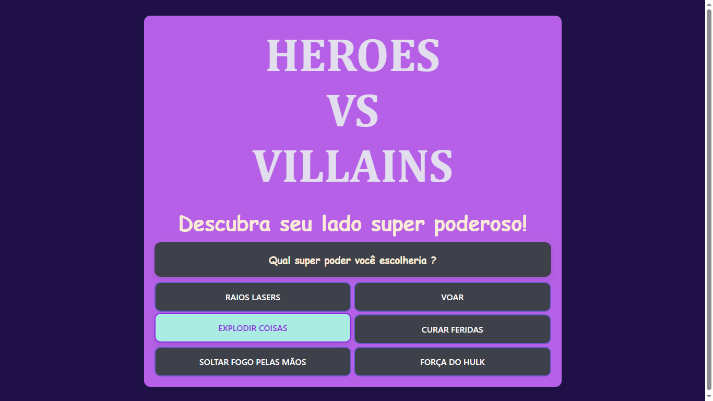
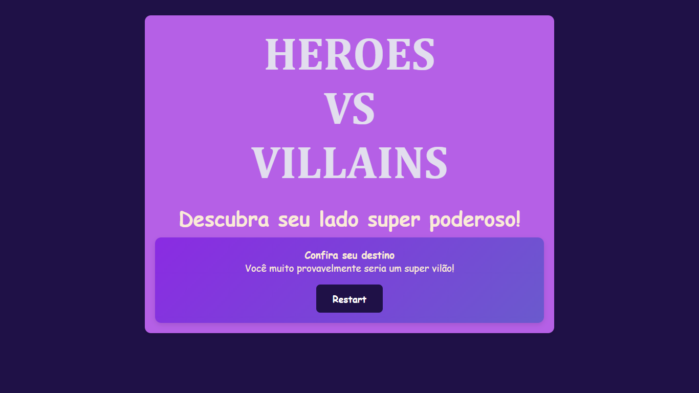

# Angular BuzzFeed Quiz Clone

Este projeto é um clone simplificado do BuzzFeed Quiz, desenvolvido em Angular, com foco em boas práticas de organização e desenvolvimento.

## Recursos Principais

- Questionários dinâmicos com pontuação automática
- Estrutura modular em Angular para facilitar manutenção
- Layout simples e adaptável

### Início do Quiz



### Final do Quiz com Reset Adicionado



## Requisitos

- Node.js (versão atualizada)
- Angular CLI (versão compatível)

## Como Instalar

1. Clone o repositório
2. Instale as dependências:
   ```bash
   npm install
   ```

## Como Executar

1. Inicie o servidor de desenvolvimento:
   ```bash
   ng serve
   ```
2. Acesse a aplicação em `http://localhost:4200`

## Estrutura de Pastas

- `src/app`: Módulos e componentes Angular
- `src/assets`: Recursos estáticos (imagens, ícones etc.)
- `src/environments`: Configurações de ambiente

## Testes

- Execute os testes unitários:
  ```bash
  ng test
  ```

## Contribuição

Contribuições são bem-vindas. Para contribuir:

1. Crie um branch para sua feature/fix.
2. Faça o commit das alterações.
3. Abra um Pull Request.

## Licença

Este projeto está licenciado sob a licença MIT. Consulte o arquivo LICENSE para mais detalhes.
